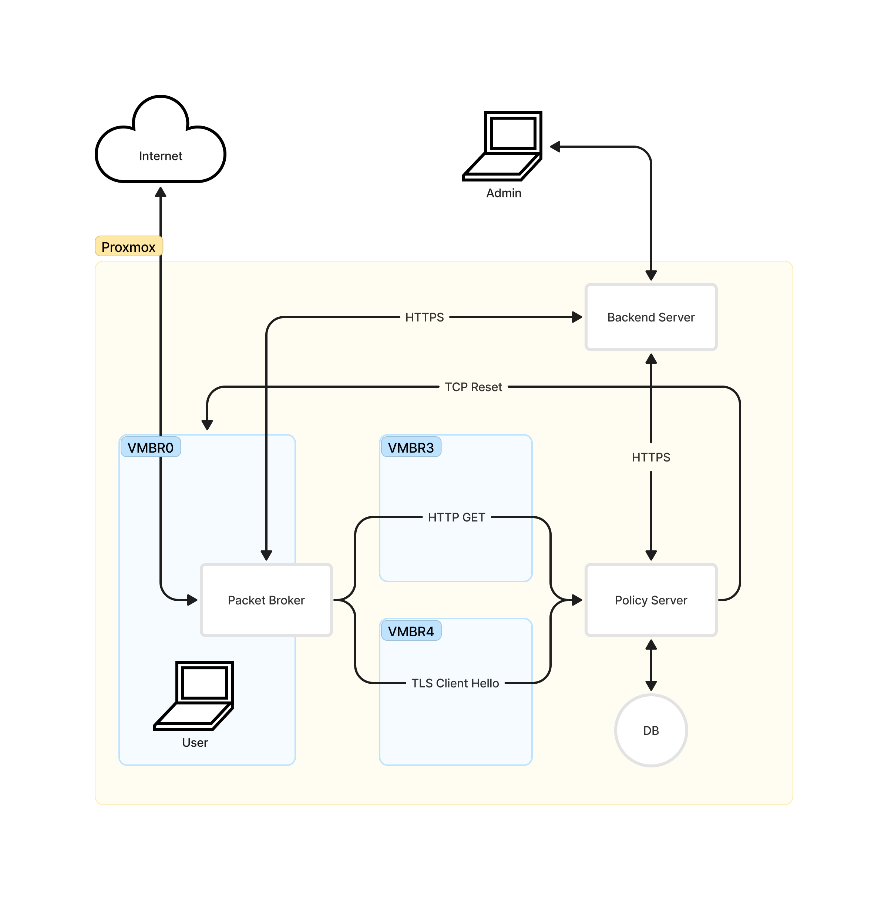

# Network Packet Broker

Packet Filtering DPDK is a high-performance software solution built on the Data Plane Development Kit (DPDK). It is designed to efficiently filter network packets, focusing exclusively on HTTP GET and TLS Client Hello packets. With Packet Filtering DPDK, network administrators can streamline packet processing and enhance network security by identifying and isolating these specific packet types with unparalleled speed and precision. This tool optimizes network performance and provides robust security for your infrastructure, ensuring efficient packet filtering without the need for any additional product branding.

## Architecture
### Network Packet Broker

NPB have a simple architecture that consist of 3 main components:
1. **RX**: Receive packets from the network
2. **Filter**: Filter packets based on the rules
3. **TX**: Transmit packets to the network

RX and TX will be handled by DPDK and for packet filtering we use Hyperscan library.

### NPB in censorship system


## Getting Started

### Prerequisites
1. DPDK 20.11.2
2. Hyperscan 5.4.2
3. Ubuntu 20.04
4. 4 NICs (1 for RX, 2 for TX, 1 for Management)

### Installation
- [Install DPDK 20.11.2](doc/DPDK-installation.md)
- [Install Hyperscan](doc/Hyperscan-installation.md)

### Startup
Run the startup script to bind the NICs to DPDK and setup Hugepages
```bash
sudo ./startup.sh
```

### Build
Build to compile the network packet broker and create directory needed
```bash
make
```

### Run
Run the network packet borker
```bash
sudo ./run.sh
```

### Clean
Clean statistics and remove the network packet broker executable
```bash
make clean
```
